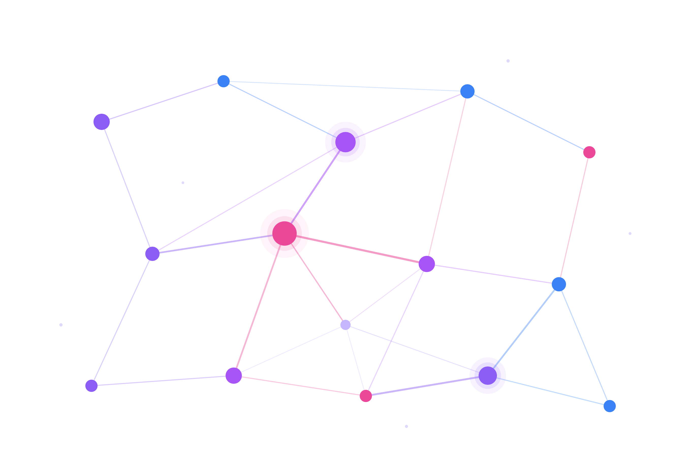
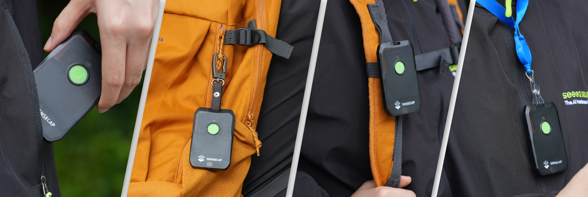

# Festival Mesh Networking Guide (Using Meshtastic)
(Enables off-grid Festival/Event communication between friends)

## Contents
- [Description](#description)
- [What you need](#what-you-need)
- [Shared-Recommended Configuration](#shared-configuration)
- [Channel Setup](#channel-setup)
- [Future additions](#future-additions)

## Description
Finding your friends at festivals without phone signal is HARD, [Meshtastic](https://meshtastic.org/) changes all that. Think: Off-Grid WhatsApp messaging that actually works! (Community Meshtastic networks have successfully communicated over hundreds of kilometers by relaying messages, using inexpensive devices, and without using any traditional mobile phone infrastructure).

This guide helps you configure and operate your off-grid mesh communications network, specifically with devices and settings that have been battle tested at festivals and events. It's been successfully tested with over 100 nodes at the beautiful Shambala festival (UK), where phone signal is non-existent yet Meshtastic works flawlessly.

### This is a community guide (very unofficial)
- The official [Meshtastic Documentation](https://meshtastic.org/docs/introduction) is excellent however, it can go into a lot of depth and is very broad (to cater to many use cases). This is a quick-start guide if you want to get you and your friends up and running quickly for an event/festival without having to wade through and understand the dense official documentation.
- This is a place to co-ordinate, share configuration, ask the community for help.
- See [GitHub Discussions Page](https://github.com/adamsthws/Festival_Mesh_Networking/discussions) to ask (and kindly answer) questions. 
- Your contributions are welcome here!

## What you need

### Companion Device
Cost: circa £30-£40 each

Each person in your group will need their own companion device paired with the Meshtastic app on their phone. Recommended festival companion devices are:
- [Seeed T1000e](https://www.seeedstudio.com/SenseCAP-Card-Tracker-T1000-E-for-Meshtastic-p-5913.html) (Good | Older | Released 2024 )
- [Rak Wizmesh Tag](https://store.rakwireless.com/products/wismesh-tag-meshtastic-gps-lora-tracker-ip66) (Better | Newer | Released 2025 )
- [Seeed X1 Tracker](https://wiki.seeedstudio.com/meshtracker_x1_intro/) **(Best | Newest | Released 2026 )**

### App (free)
>You connect your phone to your companion device over Bluetooth. You use the messaging function from the Meshtastic app on your phone.

#### Get The Meshtastic App From...
- [Apple App Store](https://apps.apple.com/gb/app/meshtastic/id1586432531)
- [Google Play Store](https://play.google.com/store/apps/details?id=com.geeksville.mesh)
- [F-Droid App Store](https://f-droid.org/en/packages/com.geeksville.mesh)

## Shared Configuration 
#### (Recommended Settings, To The Benefit Of All)
For the highest certainty that your messages will be delivered reliably at your event, use the settings below...

> **For the most effective mesh: every node at the event uses the same modem/radio settings**... The intention of this repo is to give everyone a reference for settings/configuration so that we all help each other out. This only works if we're all using the same LoRa modem / Radio settings (eg, same region, same same preset, same frequency slot etc).

 > **Why these settings specifically?**... At festivals/events, you can expect to see a high density of nodes in a small geographic area, whereby range becomes far less of a concern than network congestion. (~100 nodes is approaching the limit of the default "LongFast" preset, where congestion becomes problematic - we expect to see more than ~100 nodes, so the following settings help us to overcome the congestion limitations of the default "LongFast" preset!).

 > **Note**... As we are all sharing the same airwaves, please kindly configure your nodes responsibly and with consideration... If you configure them incorrectly, you will negatively affect everybody's experience, including your own. 

### Device Roles
- `CLIENT` For almost ALL nodes (any node that you carry around with you).
- `CLIENT_BASE` for nodes on top of your camper van / tent / venue.

#### Avoid ROUTER/REPEATER mode
- [Avoid ROUTER/REPEATER mode](https://meshtastic.org/docs/configuration/tips/#avoid-routerand-repeater)
- ONLY for EXCEPTIONALLY well-sited nodes (eg: Nodes 20+ metres up, central, on a TALL mast / in a TALL tree).
- Too many (or poorly placed) ROUTER nodes will cause network issues. (Official documentation reccomends that you only use ROUTER/REPEATER mode if you understand what what the impications are of this mode).
- If at Shambala Festival (UK) - Router nodes have already been placed, you don't need any additional router nodes here.

#### All Other Roles
- Ignore them, they aren't relevant for festivals/events. 

**LORA CONFIG**
> Note: If a setting isn't in this list, leave it at its default.

| Setting | Value | Notes |
|---|---|---|
| Country/Region | Europe 868mhz | For UK / Europe |
| Preset | Short-Fast | "Short Range - Fast" handles far more nodes than the default Long-Fast preset before becoming congested - see [Presets Documentation](https://meshtastic.org/docs/overview/radio-settings/#presets) |
| Follow Preset Coding Rate | ON | "Short Fast" Preset Default = 4/5 |
| Number of Hops | 3 | 3 = default (Truly, 3 is fine here) |
| Frequency Slot | 0 | 0 = default |
| RX Boosted Gain | OFF | Uses more battery when on; not required in a dense network at events |
| Frequency Override | OFF / 0 | leave as default |
| Transmit Power | MAX | This varies from device to device. Use the maximum available |
| Rebroadcast Mode | Core Portnums Only | Reduces congestion by only rebroadcasting standard packets: NodeInfo, Text, Position, Telemetry, and Routing |
| Ignore MQTT | ON | We don't need MQTT |
| OK to MQTT | OFF | We don't need MQTT |

**USER CONFIG**
> Note: If a setting isn't in this list, leave it at its default.

| Setting | Value | Notes |
|---|---|---|
| Long Name | -Set your long name- | Set your name so your friends can differentiate you |
| Short Name | -Set your short name- | Set your name so your friends can differentiate you |

**POSITION CONFIG**
> Note: If a setting isn't in this list, leave it at its default.

Please be considerate when configuring postions settings. The following settings are recommended - they're accurate enough to find your friends without flooding and overwhelming the network with very frequent updates.

| Setting | Value | Notes |
|---|---|---|
| Smart Position | ON | Only sends a position update when the distance/time thresholds below are met, instead of every fixed interval - reduces channel congestion |
| Minimum Interval | 5 Mins | Won't send a position update more often than this, even if moving |
| Minimum Distance | 30 Metres | Won't send a position update unless you've moved at least this far since the last one |
| Device GPS Update Interval | 5 Mins | How often the GPS chip itself takes a fix; keep in line with Minimum Interval so a fix is ready when Smart Position wants to send |

## Channel Setup
Meshtastic is multi-channel (in the same way you might have multiple WhatsApp groups)
- A public channel (eg: everyone within range)
- A private channel (eg: a private WhatsApp group between only you and your friends)
- Multiple private channels to keep different groups of friends separate.

### Easiest Channel Setup
(A single private channel, no public channel):
- Delete the default public channel (This has no encryption, location sharing doesn't work)
- Add a new channel, name it, enable encryption (key size: 256-bit). (This will be your primary, private channel. Location sharing works)
- (Optional): On your new private, primary channel, enable [`Position Requests` and `Precise Location`](https://meshtastic.org/docs/configuration/radio/channels/#position-precision)
- MQTT: Uplink & Downlink: OFF
- Share your channel with your friends. (`SETTINGS` > `SHARE QR CODE`)

### Multi-Channel Setup
(Public channel and one (or more) private channels):
- See official manual [here](https://meshtastic.org/docs/configuration/tips/#sharing-location-on-a-private-secondary-channel)

## Future additions
To-Do / Contributions welcome...

- **Map overlays** - Each year the festival map changes with the new venue layout. We must obtain the new festival map and overlay it to the correct latitude/longitude within the Meshtastic app - doing so enables you to see the location of your friends, relative to the festival layout. This assumes you are using one of the companion devices that include GPS/GNSS functionality (see recommended devices above).
- **Alternative mesh technologies** - In the future this repo may also include information about using MeshCore, which is an alternative to Meshtastic.
- **Coordinate on ROUTER/REPEATER locations** - Agree placement as a group so routers don't clash or cause congestion.
- **Contact festival organisers** - Request placing a ROUTER node on one of the festival's existing masts.
- **Where to buy** - Links / Group-buys for companion devices.
